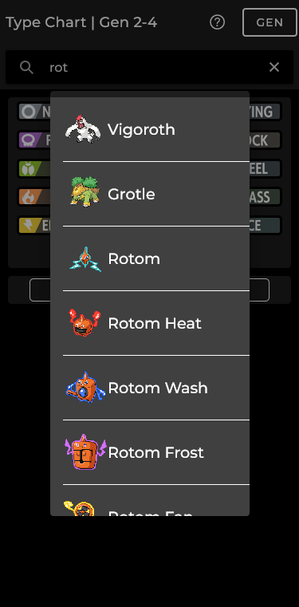
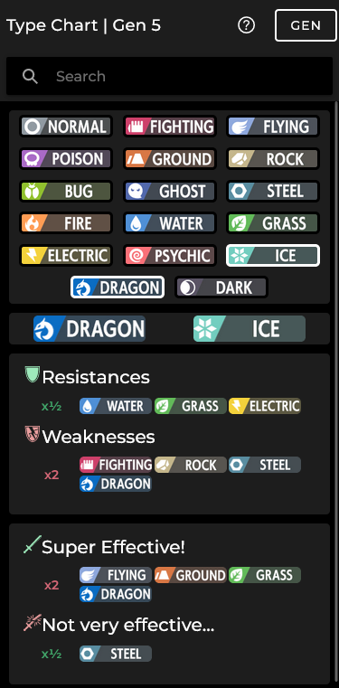

# Dynamic Pokémon Type Chart

<a href="https://juang05.github.io/DynamicPokemonTypeChart/" target="_blank" rel="noopener noreferrer">
GitHub Page
</a>

An app made by a fan, for fans.

The goal is to provide an easier way to get the Resistances and Weaknesses of the Pokémon types.

Get to choose the type chart of whatever generation you are playing.
Updated to Generation 9 (Pokémon Scarlet and Violet). Before DLC(s)

This app is an extract from another unfinished side project of mine.

# v1.1

- Search bar for pokémon included in generation.
- Add selected pokémon type(s) into slots.

# v1.0

- Generation filter for type chart.
- Resistances and Weaknesses.
- Super Effective and Not very efective.

### At some point...

- Improved UI for desktop and mobile.

# Preview

