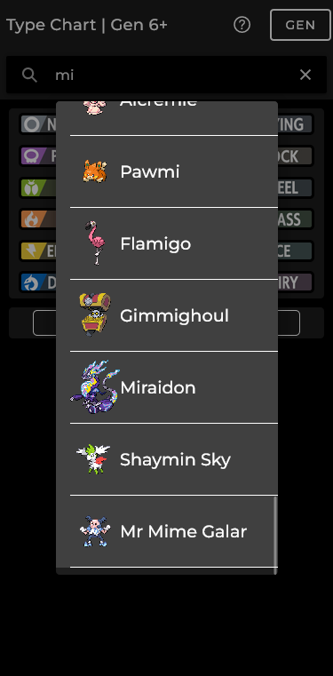
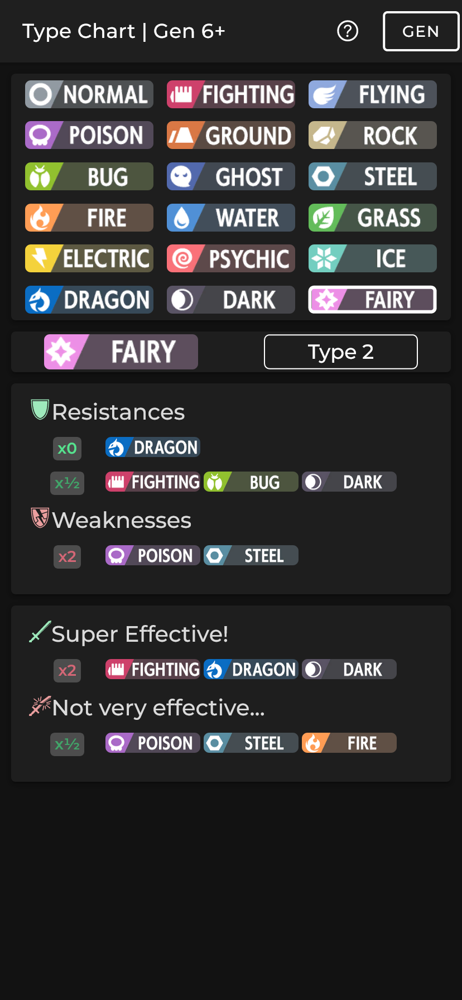

# Dynamic Pokémon Type Chart

An app made by a fan, for fans.

The goal is to provide an easier way to get the Resistances and Weaknesses of the Pokémon types.

The 3 versions of type charts are included:
- Gen 1
- Gen 2-5
- Gen6+

This app is an extract from another unfinished side project of mine.

# v1.0
- Dynamic Types
- Different generations
- Resistances and Weaknesses
- Super Effective and Not very efective

## At some point
- Search bar for pokémon included in generation
- Add selected pokémon type(s) into slots
- Improved UI 

# Preview

